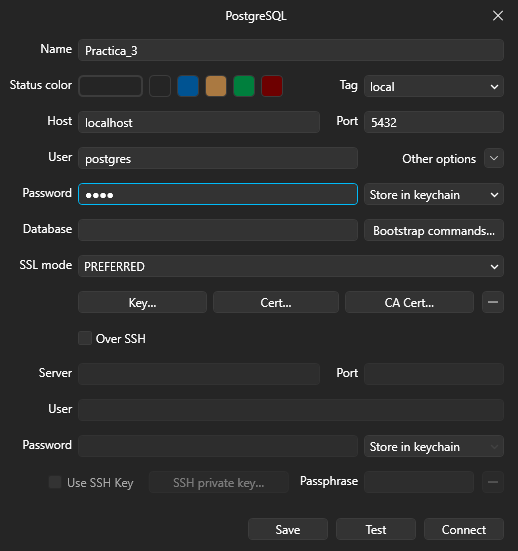
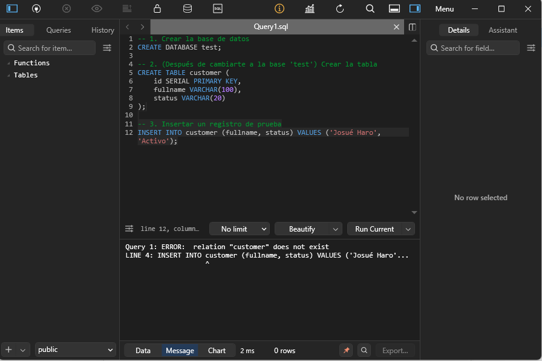
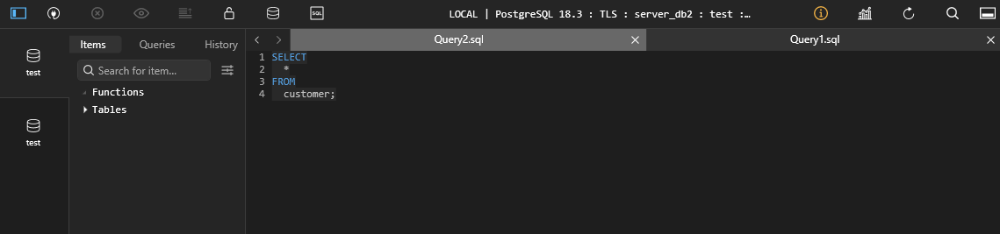

# Práctica No 3: Volúmenes para persistir base de datos

## 1. Título
Implementación de volúmenes para persistir base de datos.

## 2. Tiempo de duración
120 minutos.

## 3. Fundamentos
La arquitectura de almacenamiento de Docker. Por defecto, los contenedores utilizan un sistema de archivos 
de unión (Union File System) que crea una capa de escritura delgada sobre la imagen base. Esta capa es efímera: si el contenedor se elimina, todos los datos 
generados en esa capa desaparecen permanentemente.

Para solucionar esto, Docker ofrece Volúmenes Nombrados. A diferencia de la capa de escritura del contenedor, los volúmenes se almacenan en una parte del sistema 
de archivos del host gestionada por Docker. Esto permite:

Persistencia: Los datos sobreviven al ciclo de vida del contenedor.

Desacoplamiento: El motor de la base de datos (PostgreSQL) puede actualizarse o eliminarse sin afectar los datos almacenados en el volumen.

Rendimiento: Los volúmenes tienen un mejor desempeño de lectura/escritura que la capa de almacenamiento estándar del contenedor.

En el caso específico de PostgreSQL, el contenedor busca los datos en rutas críticas como /var/lib/postgresql/data. 
Al montar un volumen en esa ruta, "engañamos" al contenedor para que escriba directamente en nuestro almacenamiento persistente.

## 4. Conocimientos previos
- Manejo de terminal Linux (CLI).
- Comandos Docker.
- Uso de clientes de bases de datos (TablePlus).
- Sintaxis básica de SQL.

## 5. Objetivos
- Implementar la persistencia de datos en un motor de PostgreSQL utilizando 
Volúmenes para asegurar que la información sobreviva al ciclo de vida del contenedor.

- Comprobar la naturaleza efímera de los contenedores de Docker mediante la creación 
y eliminación de una base de datos sin persistencia configurada.

## 6. Equipo necesario
- Computadora.
- Docker Desktop/WSL2
- Warp Terminal.
- Table Plus

## 7. Material de apoyo.
- Documentación oficial de Docker (Volumes).
- Guía de la asignatura Video clase Volúmenes.
- Repositorio Git de comandos de la semana de Volúmenes.

## 8. Procedimiento
Paso 1: Creación de Contenedor sin Volumen
Se creó un contenedor llamado server_db1 mapeando el puerto 5433.
docker run --name server_db1 -e POSTGRES_PASSWORD=1234 -p 5433:5432 -d postgres

Paso 2: Configuración en TablePlus y pérdida de datos
Se conectó TablePlus al puerto 5433 y se ejecutó un script SQL para crear la base test y la tabla customer. 
Tras eliminar el contenedor con docker rm -f server_db1 y recrearlo, se verificó que la tabla desapareció.

Paso 3: Creación de Volumen y Contenedor Persistente
Se creó un volumen llamado pgdata y se levantó el contenedor server_db2 en el puerto 5435.
docker volume create pgdata
docker run --name server_db2 -e POSTGRES_PASSWORD=1234 -p 5435:5432 -v pgdata:/var/lib/postgresql -d postgres.

Paso 4: Validación de persistencia
Se repitió la creación de datos en server_db2. Al eliminar este contenedor y volverlo a crear con el mismo volumen, 
los datos se mantuvieron íntegros en TablePlus.

## 9. Resultados esperados
Creación correcta de los contenedores y el volumen a utilizar. E integridad de los datos al eliminar el contenedor mediante el volumen.
## Configuración TablePlus

Se puede observar como se configuro la conexión de TablePlus con los contenedores creados.
## Creación Datos tablas

En esta imagen se muestra la creacion de tablas y datos para probar la persistencia de datos.
### Server_db1 (Contenedor sin volumen)

En esta imagen se puede ver el contenedor server_db1 que, despues de eliminarlo y volverlo a crear, 
los datos que contenía fueron eliminados.
### Server_db2 (Contenedor con Volumen)

En esta imagen se puede ver el otro Contenedor, el cual despues de hacer el mimso proceso de eliminación, 
se puede observar que los datos se mantuvieron gracias a que el columen los guardo.
## 10. Bibliografía
- Docker. (2026). Docker documentation. Docker. https://docs.docker.com/
- Guaman, M. (2024). Informe-tendencias. Github. https://github.com/maguaman2/informe-tendencias

